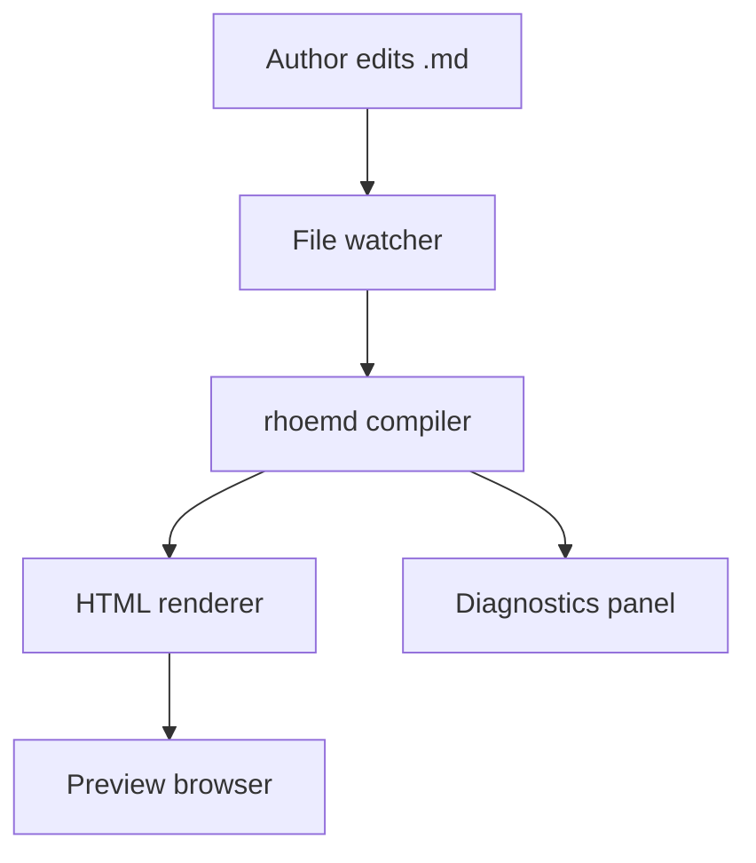

> Run: `rhoemd Examples/sources/architecture-rfc.md -o Examples/outputs/architecture-rfc.html --format html --css --pretty`

# RFC-001: Local Preview Service {#rfc-local-preview}

## Summary

This RFC proposes a local preview service that watches a Markdown workspace,
compiles changed documents, and streams updates to a browser preview.

!!! warning "Design constraint"
The preview server must never require authors to abandon plain Markdown. The
source remains the portable contract.
!!!

## Architecture

## Interface Contract

| Endpoint | Method | Purpose |
| --- | --- | --- |
| `/health` | GET | readiness check |
| `/render` | POST | compile one document |
| `/events` | GET | stream file-change events |

## Decision

Use a small local service rather than a global daemon. It has fewer privileges,
clearer lifecycle ownership, and simpler debugging.

!!! note "Risk register"
The largest risk is confusing preview failures with compiler failures. The
service should expose diagnostics separately from transport status.
!!!

## Acceptance Criteria

- The service compiles a single file without a project.
- The service emits structured diagnostics.
- The service exits cleanly when the parent process terminates.
