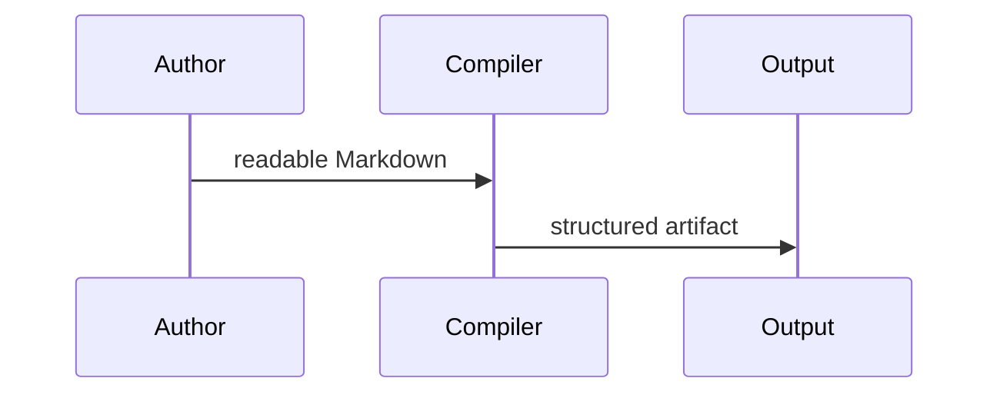

> Run: `rhoemd Examples/sources/language-showcase.md -o Examples/outputs/language-showcase.html --format html --css --pretty`

# RhoeMarkdown Language Showcase {#language-showcase .example}

This document exercises the public `0.1.0` syntax surface in one compact file:
**strong text**, *emphasis*, `code spans`, ==highlights==, $E = mc^2$, wiki
links like [[Language Reference|the language reference]], and citations such as
[@doe2026].

!!! note "Semantic block"
Admonition fences express semantic blocks such as notes, warnings, examples,
definitions, theorems, and proofs.
!!!

!!! theorem "Projection Invariant" {#thm-projection}
Every renderer receives the same normalized AST, even when the output target is
HTML, Typst, LaTeX, DOCX, PDF, EPUB, or WebAssembly-facing JSON.
!!!

## Attributes And Tables {#attributes}

| Feature | Syntax | Label |
| --- | --- | --- |
| Heading attributes | `{#id .class}` | RhoeMarkdown extension |
| GFM tables | pipe tables | GitHub Flavored Markdown |
| Cross-references | `@thm-projection` | RhoeMarkdown extension |
| Fenced divs | `:::` blocks | structured layout |
| Client diagrams | mermaid fences | web-friendly diagrams |

See @thm-projection for the theorem-style semantic block.

::: {.columns count=2}
- Left column: source remains readable as plain Markdown.
- Right column: renderers still receive structured attributes.
:::

```swift {#swift-sample .executable executable=false}
let compiler = "RhoeMarkdown"
let release = "0.1.0"
```



Footnotes work too.[^syntax]

[^syntax]: Footnotes are parsed as reference metadata and rendered by target writers.
