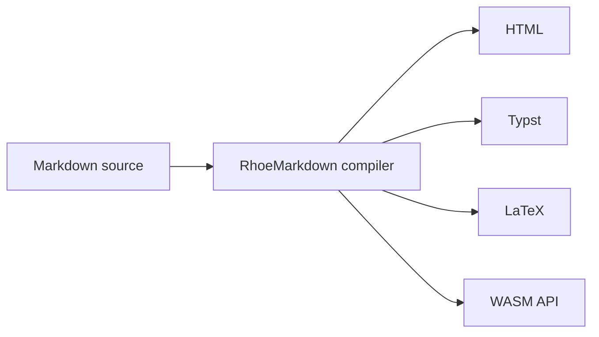

> Run: `rhoemd Examples/sources/slides-outline.md -o Examples/outputs/slides-outline.html --format html --css --pretty`

# Launch Narrative {#launch-narrative .deck}

%%%

## 1. The Problem

Teams have too many document formats and too little semantic continuity.

!!! note "Speaker cue"
Start with the pain: every exported format becomes another place for meaning to
drift.
!!!

%%%

## 2. The Move

RhoeMarkdown keeps authoring plain while preserving structure for compilers,
editors, publishing systems, and automation.

%%%

## 3. The Proof

- One source file.
- Multiple outputs.
- Stable compiler contract.
- Reproducible examples.

!!! success "Demo beat"
Open the generated HTML next to the source file and show how little ceremony is
needed to produce a useful artifact.
!!!

%%%

## 4. The Invitation

Clone the repo, run the examples, and help harden the compiler surface.
